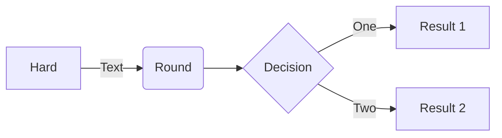

# Architecture &amp; roadmap

## Design and core concepts

The core concept and architecture for the PatternFly MCP server is centered around being a library resource for all things PatternFly.
It is intended to be extensible to meet the needs of different teams and projects, from simple to complex, from design to development.

### PatternFly integration

### Node.js patterns

## Server architecture

### Current state

### Future ecosystem

## Roadmap

### Planned features and integrations
- PatternFly API integration
- Find PatternFly tool
- MCP resource, prompts, and helper function sharing for custom tools.
- YAML config for custom tools, resources, and prompts

